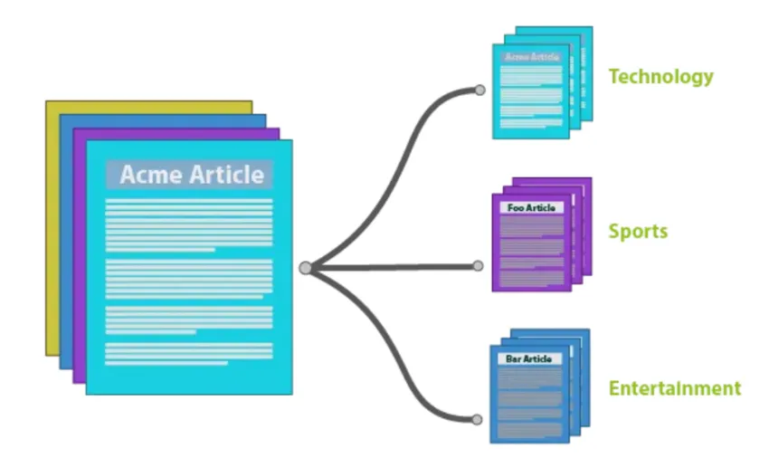
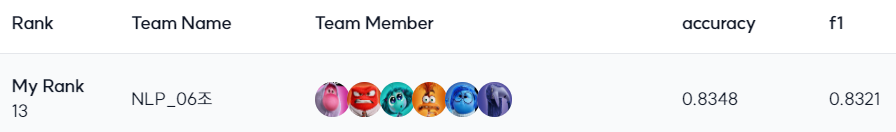

## 📰 Data-Centric 주제 분류 프로젝트
### 🌈 개요
- 뉴스 기사 제목 분류
- 모델 파트의 수정 없이 Data-Centric 방식으로 모델의 성능 향상 도모
- 기간: 2024.10.30 ~ 2024.11.07
- Wrap-Up Report

<p align="center"></p>

<br>

### ⭐ 결과
대회 종료 후 private score 비교 결과, 기존 baseline*(macro-f1 0.5980)*을 기준으로 **23.41%p** 향상

<p align="center"></p>

<br>

### 🤗 역할 분담

| **팀원** | **역할** |
| --- | --- |
| 서태영 <a href="https://github.com/sty0507"></a> |  |
| 오수현 <a href="https://github.com/ocean010315"></a> |  |
| 이상의 <a href="https://github.com/LeSaUi"></a> |  |
| 이정인 <a href="https://github.com/leeennn"></a> |  |
| 이정휘 <a href="https://github.com/LeeJeongHwi"></a> |  |
| 정민지 <a href="https://github.com/minjijeong98"></a> |  |

<br>

### 🗃️ 폴더 구조

```bash
.
├─preprocess
│  ├─jeonge
│  ├─jeongin
│  ├─minji
│  ├─sangui
│  ├─shyun
│  └─taeyoung
│─src
│  ├─dataset.py
│  └─trainer.py
├─.gitignore
│─data_ensemble.py
├─main.py
├─README.md
└─requirements.txt
```

- `dataset.py`, `main.py`, `trainer.py`: 실험의 용이성을 위해 베이스라인 코드 모듈화
- `data_ensemble.py`: 개별적으로 수행한 전처리, 증강 데이터에 대한 앙상블 코드
- `preprocess`: 개별적으로 수행한 데이터 분석, 전처리, 증강 모듈이 포함된 디렉토리
    - 각각의 방식에 대한 확인, 재현은 개별 README.md를 통해 확인
    - [jeonge](./preprocess/jeonge/README.md), [jeongin](./preprocess/jeongin/README.md), [minji](./preprocess/minji/README.md), [sangui](./preprocess/sangui/README.md), [shyun](./preprocess/shyun/README.md), [taeyoung](./preprocess/taeyoung/README.md)

<br>

### 💡 주요 접근 방식

| **과정** | **내용** |
| --- | --- |
| **EDA** | • ASCII 코드, 형태소 분석 기반으로 텍스트 데이터의 노이즈 파악 <br> • 텍스트 노이즈와 라벨 노이즈는 겹치지 않는다는 정보를 활용하여 라벨 노이즈 파악 |
| **텍스트 전처리** &nbsp;&nbsp; | • 규칙 기반: re, hanja, spacy 사용 <br> • 모델 기반: LLaMA* 프롬프팅 |
| **라벨 전처리** | • 재생성: LLaMA* 프롬프팅 <br> • clustering: SBERT(sinjy1203/ko-sbert-navernews)를 사용하여 텍스트 임베딩 <br> • CleanLab: baseline(klue/bert-base) 모델 |
| **증강** | • Masked Language Modeling: baseline(klue/bert-base), rtzr/ko-gemma-2-9b-it <br> • Back Translation: DeepL, Google Translator, NLLB(facebook/nllb-200-distilled-600M, NHNDQ/nllb-finetuned-en2ko) <br> • Synonym Replacement: baseline(klue/bert-base)의 vocab, SBERT(snunlp/KR-SBERT-V40K-klueNLI-augSTS) |
| **합성 데이터** | • LLaMA* 프롬프팅 |
| **앙상블** | • 개별적으로 적용한 기법으로 처리한 데이터셋 concat <br> • 유사한 텍스트의 label이 다를 경우, baseline 모델로 추론하여 라벨 부여 |

> \* Bllossom/llama-3.2-Korean-Bllossom-3B, meta-llama/Llama-3.1-8B-Instruct, sh2orc/Llama-3.1-Korean-8B-Instruct

<br>

### 🛠️ 환경 설정 및 사용법

> 개별 데이터의 전처리, 증강 방식은 [각각의 README.md](#-🗃️-폴더-구조) 확인

**개발 환경**

| **Component** | **Specification** |
| --- | --- |
| **GPU** | NVIDIA Tesla V100 |
| **RAM** | 32 GB |
| **OS** | Linux |
| **Python Version** | 3.10 |
| **주요 라이브러리** | transformers |

**설치 및 환경 설정**

```bash
git clone https://github.com/boostcampaitech7/level2-nlp-datacentric-nlp-06.git
pip install -r requirements.txt
```

**학습 및 추론**

```bash
python main.py --data {data_path} --model {model_path} --mode {train/test}
```

- **`--data`**: train.csv, test.csv가 저장된 폴더 경로
- **`--model`**: `--mode train`일 시에는 학습한 모델을 저장할 경로, `--mode test`일 시에는 학습된 모델이 저장된 경로

**데이터 앙상블**

```bash
python data_ensemble.py --data {data_path} --model {model_path}
```

- **`--data`**: 개별적으로 처리한 학습 데이터를 하나의 폴더 내로 이동
- **`--model`**: 데이터 앙상블을 적용할 모델 경로
