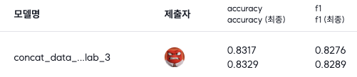
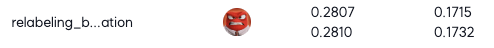

# 개요
- Data Centric-AI 프로젝트 진행하면서 사용한 파일 디렉토리

# 폴더 구조
```bash
taeyeong
├── README.md
├── data_ensemble.py
├── translate_prompting.py
└── src
    ├── data_ensemble.ipynb
    ├── methods_i_tried.ipynb
    └── test.ipynb
```

<br>

# Data_ensemble.py
## What is?
- 개인별로 실험했을 때 가장 성능이 좋았던 데이터셋을 모아 cleanlab을 통해 relabeling을 수행
## How to?
- `python3 data_ensemble.py --data ./dataset_path --model ./model_path --model_name /checkpoint`
- `--data` : 데이터셋이 담긴 디렉토리 경로. 경로에 있는 모든 csv 파일을 다 합치는 과정을 수행합니다.
- `--model` : cleanlab에 사용될 모델의 경로.
- `--model_name` : cleanlab에 사용될 모델의 이름. model에 입력한 경로 안에 있는 checkpoint와 같은 모델 이름을 입력합니다.
## Result
  

<br>

# translate_prompting.py
## What is?
- 번역 라이브러리를 통해 라벨 매핑 값을 리턴하는 작업 수행
## How to?
- `python3 translate_promtping.py --data ./dataset_path --model model_name`
- `--data` : 데이터셋이 있는 경로
- `--model` : 사용할 huggingface 모델 명. default는 `MLP-KTLim/llama-3-Korean-Bllossom-8B` 입니다.
## Result
  

<br>

# ipynb_files
## What is?
- 프로젝트를 하면서 시도했던 ipynb 파일들.
## I Used
- 번역 : Deepl, googletrans
- llm : llama