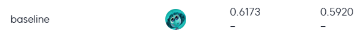
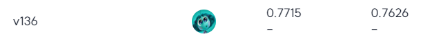

## 📰 Data-Centric 주제 분류 프로젝트
### 🌈 개요
- 뉴스 기사 제목 분류  
- 모델 관련 부분의 수정 없이, 데이터 조작만으로 모델 성능을 향상

### 🗂️ 파일 구조
```bash
.
|-- README.md
|-- key_maps.json
|-- prep_main.py
`-- src
    |-- augmentation.py
    |-- clean.py
    |-- llama.py
    `-- prompt.py
```

### 📝 How To
**`Installation`**  
```bash
git clone https://github.com/boostcampaitech7/level2-nlp-datacentric-nlp-06
cd shyun
pip install -r requirements.txt
# or just install hanja, cleanlab, transformers, sentence-transformers
```

- **`prep_main.py`**: **src**의 모듈들을 사용하여 데이터 전처리, 증강을 수행  
- **`src/llama`**: LLaMA 모델을 이용한 **라벨 추출**, **텍스트 정제**, **라벨 정제**(src/prompt에서 system prompt와 fewshot prompt 호출)  
- **`src/clean`**: re, hanja, cleanlab을 이용한 **텍스트 정제 및 오염도 확인**  
- **`src/augmentation`**: NLLB 모델, SBERT 모델을 이용한 **역번역**, Easy Data Augmentation-**Synonym Replacement** 증강 기법  

### 🚀 결과
**최종 성능**  
baseline  

  

result

  

**최종 선택한 기법**  
1. `src/clean` clean_characters  
2. `src/llama` clean_text, clean_label  
3. polluted_lv > 0.3 약 965개 삭제  
4. `src/llama` generate_new, regenerate: 불균형 라벨 증강(label=3 100개)  
5. `src/augmentation` back_translation: 각 라벨 50개씩 증강  
6. `src/augmentation` eda_sr: 전체 데이터에 적용, 2배로 증강  
